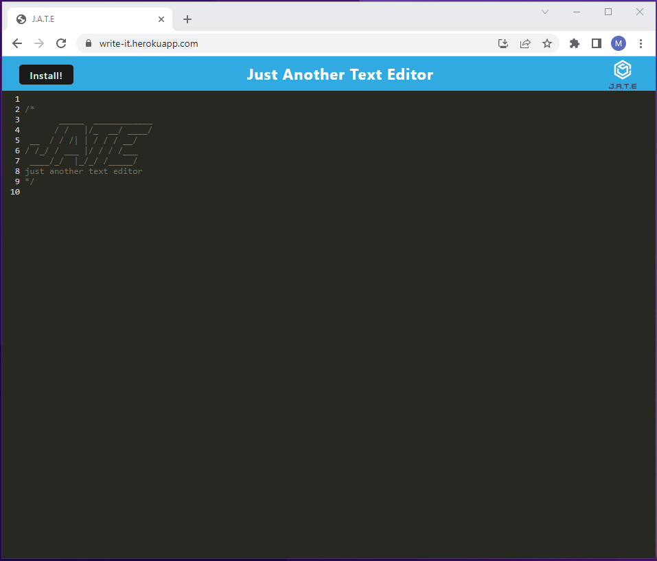
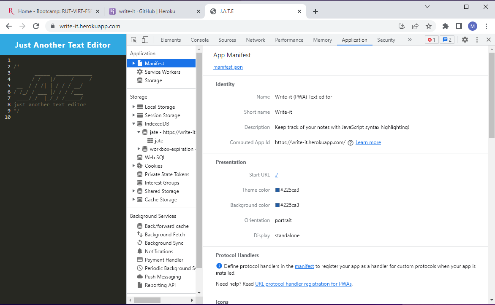
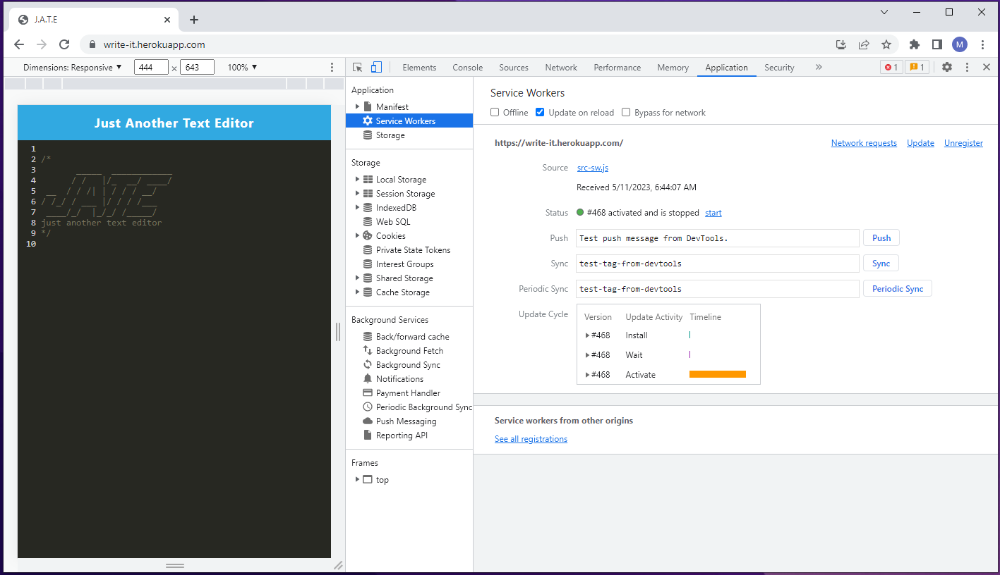
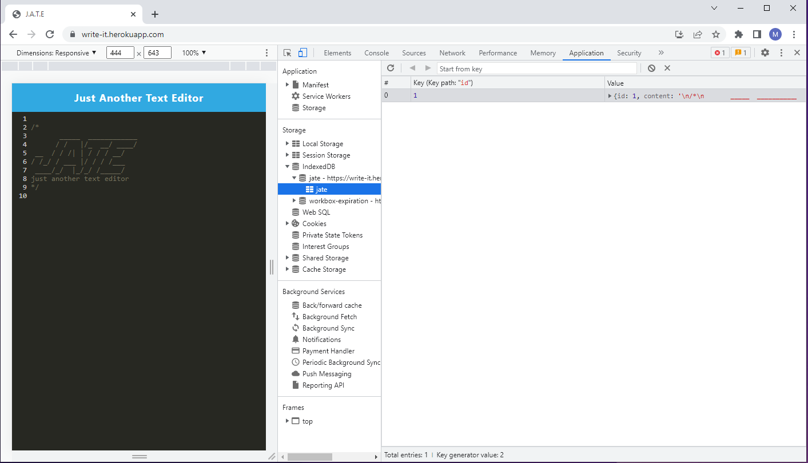

# write-it

## Description

Progressive Web Applications (PWA): Text Editor
App uses IndexDB and LocalStorage which allows users to create notes or code snippets 
with or without internet connection that can be retrieved for later use.

- [write-it](#write-it)
  - [Description](#description)
  - [Installation](#installation)
    - [Link to GitHub Repo](#link-to-github-repo)
    - [Link to deployed application](#link-to-deployed-application)
  - [Usage](#usage)
  - [Mock-up](#mock-up)
    - [Editor](#editor)
    - [Manifest](#manifest)
    - [Service Worker](#service-worker)
    - [indexDB](#indexdb)
  - [Contributors](#contributors)
  - [License:](#license)
  - [Questions](#questions)
    - [GitHub](#github)
    - [e-mail](#e-mail)

## Installation 

This app can run in browser or be installed in user's operating system by clicking on the 'install' button visibile on the screen.

### Link to GitHub Repo

[https://github.com/mnyzio/write-it](https://github.com/mnyzio/write-it)

### Link to deployed application

[https://write-it.herokuapp.com](https://write-it.herokuapp.com)

## Usage

Local storage is keeping track of changes real time while IndexDB is getting updated each time user click outside the editor (on blur).

## Mock-up

### Editor 

### Manifest

### Service Worker

### indexDB

## Contributors

Mirek Nyzio

## License:

MIT License

## Questions

### GitHub

[www.github.com/mnyzio](www.github.com/mnyzio)

### e-mail

[m.nyzio@outlook.com](m.nyzio@outlook.com)